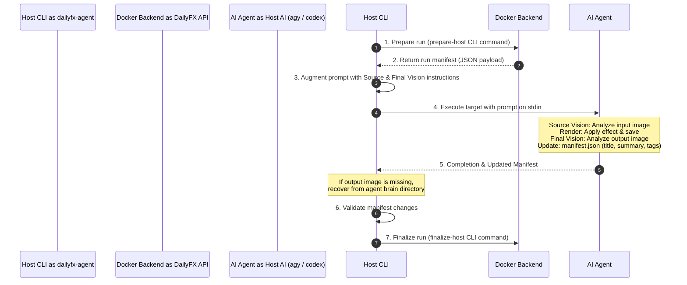

# DailyFX Host Agent (`dailyfx-agent`)

The `dailyfx-agent` is a host-side orchestrator script written in Python. It acts as a bridge between the DailyFX backend running inside Docker containers and local host-side AI agent environments (specifically Gemini/Antigravity and OpenAI/Codex).

It prepares scheduled generation runs, invokes local AI agents with visual context, validates metadata, and submits finalized results back to the backend.

---

## Architecture & Workflow

The orchestrator operates at the boundary between your local system (host) and Docker containers. This allows it to leverage host-running LLM and vision agents that require local resources or configuration, while storing data and scheduling runs within Docker.



1. **Prepare Run**: The host agent queries the Docker container to prepare a scheduled generation. The backend prepares the database entry and replies with a JSON manifest.
2. **Setup Manifest**: The manifest is saved temporarily on the host and copied to a directory shared with the container.
3. **Execute AI Tool**: The script runs the local tool (`agy` or `codex`) via shell. It streams progress labels from the container's generation trace to a visual spinner.
4. **Agent Action**: The local agent receives the prompt (injected with vision tasks) on standard input, processes the image, saves the result, and updates the local manifest file.
5. **Verify & Recover**: The script checks if the image exists. If not, it recovers the image from known agent directories. It then validates that the agent successfully updated the title, summary, and tags.
6. **Finalize**: The script triggers the finalization CLI command inside the container to upload the image and store the metadata.

---

## CLI Reference

Execute the agent from the project root:

```bash
./dailyfx-agent [OPTIONS]
```

### Options

| Flag | Type | Default | Description |
|---|---|---|---|
| `-s, --schedule-id` | `int` | `None` | Schedule ID to execute. Required unless `--list-schedules` is used. |
| `-t, --target` | `str` | `None` | Target tool to call (`agy` or `codex`). Required unless listing schedules. |
| `-m, --model` | `str` | `None` | Specific model to use for the selected target. |
| `-l, --list-schedules` | `flag` | `False` | List available schedule IDs and names from backend database, then exit. |
| `--list-models` | `flag` | `False` | List available models for the selected target, then exit. |
| `--compose-file` | `str` | `"docker-compose.yml"` | Path to the docker-compose YAML file. |
| `--project-dir` | `str` | `"."` | Directory containing the compose file. |
| `--service` | `str` | `"api"` | Name of the Docker Compose service running DailyFX. |
| `--manifest-path` | `str` | `None` | Optional path for the temporary manifest JSON. |
| `--keep-manifest` | `flag` | `False` | Prevent deletion of temporary manifest files after execution. |
| `--dry-run` | `flag` | `False` | Print compose and host commands without executing them. |
| `-v, --verbose` | `flag` | `False` | Print the loaded manifest payload before calling the target. |
| `--agy-command-template` | `str` | `"--print --image {image_path}"` | Command template for `agy`. Supports `{image_path}`, `{output_path}`, and `{manifest_path}`. |
| `--codex-command-template`| `str` | `"exec --image {image_path} -"`| Command template for `codex`. Supports `{image_path}`, `{output_path}`, and `{manifest_path}`. |
| `--timeout` | `int` | `600` | Timeout in seconds for the target tool execution. |
| `-x, --repeat` | `int` | `1` | Number of times to repeat the execution task. |
| `-d, --daemon` | `flag` | `False` | Run in background (detached daemon mode). Writes PID and exits immediately. |
| `--pid-file` | `str` | `None` | Path to write the daemon PID file. Defaults to `data/dailyfx-agent-{sched_str}-{target_str}.pid`. |
| `--status` | `flag` | `False` | Check the status of the daemon process. |
| `--stop` | `flag` | `False` | Stop the running daemon process. |
| `--doctor` | `flag` | `False` | Run environment diagnostics and verify dailyfx-agent setup. |

---

## The Metadata & Vision Pipeline

The orchestrator enforces a dual-vision analysis pipeline when dispatching tasks to host-side agents:

### 1. Source Vision (Context Analysis)
The agent is instructed to open and analyze the source image (`source_image_path`) on the host to understand:
- The context, subjects, and people present.
- The lighting, mood, and original setting.

### 2. Final Vision (Validation & Description)
After applying the generative effect and saving the output image, the agent must examine the final image to:
- Evaluate the aesthetic results.
- Ensure the output is correct.

### Prompt Augmentation
The script automatically appends the following instructions to the manifest prompt sent to the host agent:

```
CRITICAL: As the AI agent running on the host, you MUST perform both:
1. Source Vision: Analyze the input image (source photo) at '<absolute_input_path>' for context, theme, and people.
2. Final Vision: Analyze the final generated image (after generating/saving it) for what actually appears in it.
Use these vision steps to generate:
- A high-quality title (a short, creative 3-5 word title)
- A summary (one concise sentence describing the final image)
- A list of 3-6 descriptive tags (keywords) summarizing the image content
You MUST write/update these values in the local JSON manifest file at '<absolute_manifest_path>' under the 'title', 'summary', 'tags', and 'metadata_source' keys before exiting.
Set 'metadata_source' to 'host_agent_final_vision'.
The final output image path is '<absolute_output_path>'.
```

### Manifest Verification
Before finalizing, `dailyfx-agent` validates the updated manifest file. It raises an error and halts execution if:
- `title` is empty.
- `summary` is empty.
- `tags` is not a list, contains invalid values, or its size is not between **3 and 6** items.
- `metadata_source` is not explicitly set to `"host_agent_final_vision"`.
- The updated values are identical to the original values (verifies that the agent did not skip the step).

---

## Automatic Image Recovery (Fallback Search)

If the local agent exits successfully (`returncode 0`) but the target output file does not exist at `output_path`, `dailyfx-agent` attempts to recover the image from the agent's internal directories.

### Recovery Directories
Depending on the selected target, the script checks:
- **`codex`**: `~/.codex/generated_images`
- **`agy`**: `~/.gemini/antigravity-cli/brain`

### Selection Algorithm
1. The script lists files in the directory.
2. It filters out files that contain words like `"input"` or `"original"`.
3. It filters for image extensions: `.png`, `.webp`, `.jpg`, `.jpeg`.
4. It only considers files created/modified after the target tool's launch timestamp (with a 10-second safety buffer).
5. It selects the **most recently modified** file.
6. The script copies this recovered image to the final `output_path` and proceeds to finalize. If no candidate is found, it reports a missing output file error.

---

## Process & Log Management

### Active Visual Feedback
When running interactively (non-daemon mode), the script parses the backend's `task_trace` to display a command-line spinner on `stderr`. The spinner maps internal stages to user-friendly labels:
- `selecting_asset`, `searching_assets` -> `[search]`
- `running`, `planning` -> `[plan]`
- `applying_effect`, `rendering` -> `[render]`
- `analyzing_image`, `embedding_metadata` -> `[analyze]`
- `saving_result`, `host_finalizing` -> `[save]`
- `succeeded`, `completed` -> `[done]`
- `failed` -> `[fail]`

### Log files & Rotation
Target tool output is not printed directly to stdout. Stdin/stderr logs of the executed target command are captured and written to:
`[TEMP_DIR]/dailyfx-agent-logs/dailyfx-agent-{task_id}-{target}-{timestamp}.log`

The script automatically retains only the **5 most recent logs** for each task runner, deleting older log files to conserve disk space.

### Daemon Mode
For background execution, specify the `-d` or `--daemon` flag.
- The process forks using `os.fork()`.
- The parent log of the daemon process is redirected to a dedicated log file at `{pid_file}.log` instead of `/dev/null`.
- The child process's PID is printed to the shell and saved to a PID file (e.g. `data/dailyfx-agent-{sched_str}-{target_str}.pid`).
- A JSON metadata file is created alongside it at `{pid_file}.json`, recording: `pid`, `schedule_id`, `target`, `started_at`, `log_path`, and `manifest_path`.
- The spinner is automatically bypassed in daemon mode.
- The PID and metadata files are cleaned up when execution finishes.

### Process Status and Stopping
You can manage the running daemon process using these flags:
- `--status`: Reads the PID and JSON metadata file to check if the daemon process is running. Prints process information (running, stopped due to missing file, or stopped with stale files) along with metadata details.
- `--stop`: Reads the PID, terminates the daemon process (using SIGTERM, followed by SIGKILL if it does not exit within 2 seconds), and cleans up the PID and metadata files.

## Versioning

The `dailyfx-agent` resolves its version dynamically to stay aligned with the backend application:
1. It tries to dynamically import the backend package version (`app.version.APP_VERSION`).
2. If the import fails, it parses the `pyproject.toml` configuration file under the `backend/` directory.
3. In case both fail, it falls back to using `importlib.metadata` or a default version identifier (e.g. `"0.4.1"`).

This resolved version is used during Codex MCP initialization as the client version (under `clientInfo.version`).

---

## Examples

### 1. Show Schedules
Check the schedules configured in the database:
```bash
./dailyfx-agent --list-schedules
```

### 2. Check Available AI Models
Query models available on the host:
```bash
./dailyfx-agent --list-models --target agy
./dailyfx-agent --list-models --target codex
```

### 3. Run a Scheduled Task
Run schedule `2` using Gemini (`agy`):
```bash
./dailyfx-agent --schedule-id 2 --target agy
```

Run schedule `2` in the background (detached daemon):
```bash
./dailyfx-agent --schedule-id 2 --target agy --daemon
```

### 4. Custom Command Templates
To configure Codex to accept image data on standard input or wrap command execution:
```bash
./dailyfx-agent \
  --schedule-id 1 \
  --target codex \
  --model gpt-4o \
  --codex-command-template 'exec --image {image_path} -'
```

> **Warning**: The orchestrator quotes substituted paths automatically. Do **not** wrap `{image_path}`, `{manifest_path}`, or `{output_path}` in quotes in your templates.
