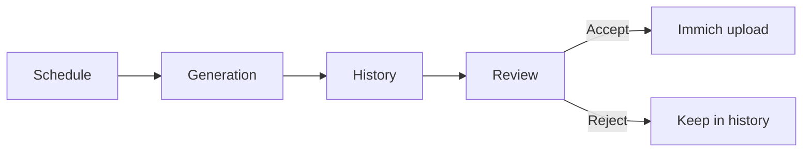

# How It Works

This page is for operators who want a quick mental model of the DailyFX workflow.

## Overview

## From Schedule To Review

1. A schedule decides when DailyFX should run and which preset combination to use.
2. The backend picks matching Immich assets based on the schedule filters.
3. DailyFX applies the selected effect or AI module.
4. The generated image is stored in the history database and shown in the review UI.
5. You review the result in the History page or from a notification.
6. If you accept it, DailyFX uploads the image back to Immich with metadata preserved.
7. If you reject it, the result stays in history and is not uploaded.

## What The Operator Configures

- `Settings`
  - Immich URL and API key
  - optional AI provider keys
  - app access token and notification-related system settings
- `Presets`
  - Filters: which Immich assets can be used
  - Effects: which module can be selected and how likely it is
  - Notifications: how DailyFX tells you a result is ready
- `Schedules`
  - when DailyFX runs
  - which filter/effect/notification presets it uses
  - which AI provider/model settings the schedule should use

## What Happens During A Run

- The background scheduler loop starts the task or you trigger a selected schedule manually.
- DailyFX searches Immich for matching assets.
- A generation module runs and produces the output image.
- Optional AI Vision can create or refine titles, summaries, and tags.
- EXIF metadata is embedded before the file is saved.
- A history entry is written with trace data and provenance.
- Notification channels can send a link to the review screen.

## What You Usually Need To Check

- No schedule runs:
  - confirm the backend container is running,
  - confirm the schedule is enabled,
  - confirm the filter preset still matches assets in Immich.
- A result looks wrong:
  - open History,
  - check the trace,
  - verify the selected effect and schedule AI settings.
- Upload failed:
  - check Immich URL/API key in Settings,
  - check the history entry for the saved error.

## Operator Checklist

Use this as the quick daily loop:

1. Open **History** and see whether recent runs completed normally.
2. If a run finished, check whether the preview looks worth uploading.
3. If something looks off, inspect the trace before changing settings.
4. If multiple runs fail, check the schedule, Immich connection, and backend container.
5. Use **Reject** when the result is not useful, or **Accept** when you want it uploaded to Immich.

## Related Docs

- [Getting Started](getting-started.md)
- [Self-Hosting Guide](self-hosting.md)
- [API Documentation](api.md) for endpoint details
