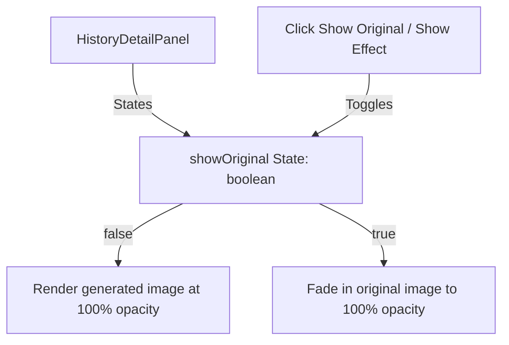

# Design Document: Simplified Before/After Image Toggle Comparison

This document describes the design and architecture for adding a simplified Before/After image comparison toggle button to the DailyFX History review panels.

## Goal
Implement a clean, conflict-free image comparison system that:
1. Uses a single button to toggle between the original photo and the styled AI result.
2. Is strictly in English ("Show Original" / "Show Effect").
3. Integrates coherently into the existing layouts for both the main `HistoryDetailPanel` and the full-screen `LightboxModal`.
4. Avoids conflicts with other interactive controls (such as the lightbox trigger and the close buttons).
5. Implements smooth fade transitions to compare different aspect ratios or compositions.

---

## Architectural Decisions

### 1. Single Toggle Button
A single toggle button will be implemented:
*   **Main Detail Panel**: Placed in the metadata header, directly next to the existing "View original in Immich" button.
*   **Lightbox Modal**: Placed as a floating button in the bottom-right corner of the image viewport.

The button text will dynamically change based on the active image state:
*   When showing the generated image: text is **"Show Original"** (with default neutral styling).
*   When showing the original image: text is **"Show Effect"** (with highlighted emerald styling).

### 2. Overlay Fade Transition
To prevent layout shifts or alignment glitches when images have different aspect ratios (e.g. standard photo vs square AI crop/Polaroid frame):
*   Both images will be loaded inside a relative container.
*   The original image is positioned absolutely on top of the generated image.
*   The original image's opacity transitions between `opacity-0` and `opacity-100` using CSS `transition-opacity duration-200`.
*   Both images use `object-contain` (centered) so that they overlap correctly.



---

## File-by-File Changes

### 1. `frontend/src/pages/History/HistoryDetailPanel.tsx`
*   Add a local state: `const [showOriginal, setShowOriginal] = useState(false);`
*   Reset this state to `false` whenever the selected `entry` changes (via `useEffect`).
*   In the metadata block next to the "View original in Immich" link, render the toggle button:
    ```tsx
    {sourceAssetImmichUrl && (
      <button
        type="button"
        onClick={() => setShowOriginal(!showOriginal)}
        className="inline-flex items-center gap-1 rounded-lg border border-emerald-200/60 bg-emerald-50 px-2 py-0.5 text-[9.5px] font-semibold text-emerald-800 transition hover:bg-emerald-100"
      >
        {showOriginal ? 'Show Effect' : 'Show Original'}
      </button>
    )}
    ```
*   In the image display section, render both the generated image and the original image overlaid:
    ```tsx
    <div className="relative group max-w-full overflow-hidden rounded-xl md:rounded-2xl border border-stone-200 bg-stone-100 shadow-[0_12px_26px_rgba(36,29,16,0.06)]">
      {/* Base: Generated image */}
      <SecureImage
        src={`${entry.image_url}?thumbnail=true`}
        alt={entry.title}
        className="w-full max-h-[220px] md:max-h-[320px] cursor-zoom-in object-contain mx-auto transition-transform duration-500 ease-out group-hover:scale-[1.015]"
        onClick={() => onOpenLightbox(entry.image_url ?? '')}
      />
      {/* Overlay: Original image */}
      {sourceAssetId && (
        <div
          className={`absolute inset-0 bg-stone-100 transition-opacity duration-200 pointer-events-none ${
            showOriginal ? 'opacity-100' : 'opacity-0'
          }`}
        >
          <SecureImage
            src={`/api/immich/assets/${sourceAssetId}/thumbnail?size=preview`}
            alt="Original"
            className="w-full h-full object-contain mx-auto"
          />
        </div>
      )}
      ...
    </div>
    ```

### 2. `frontend/src/pages/History/LightboxModal.tsx`
*   Add a local state: `const [showOriginal, setShowOriginal] = useState(false);`
*   Determine the original image URL by parsing `entry.source_asset_ids`.
*   Render the toggle button in the bottom-right corner of the image canvas:
    ```tsx
    {originalImageUrl && (
      <button
        type="button"
        onClick={() => setShowOriginal(!showOriginal)}
        className="absolute bottom-4 right-4 z-30 inline-flex items-center gap-1.5 rounded-xl border border-white/10 bg-stone-900/80 px-3 py-1.5 text-xs font-bold text-white shadow-lg backdrop-blur-md transition hover:bg-stone-950 active:scale-95"
      >
        <Layers size={13} />
        {showOriginal ? 'Show Effect' : 'Show Original'}
      </button>
    )}
    ```
*   Overlay both images in the canvas section with the same transition logic:
    ```tsx
    <div className="relative flex max-h-[52vh] flex-1 items-center justify-center bg-stone-950 p-2 md:max-h-[85vh]">
      <SecureImage
        src={imageUrl}
        alt="Preview"
        className="max-h-full max-w-full rounded-lg object-contain"
      />
      {originalImageUrl && (
        <div
          className={`absolute inset-0 flex items-center justify-center bg-stone-950 transition-opacity duration-200 ${
            showOriginal ? 'opacity-100' : 'opacity-0'
          }`}
        >
          <SecureImage
            src={originalImageUrl}
            alt="Original Preview"
            className="max-h-full max-w-full rounded-lg object-contain"
          />
        </div>
      )}
    </div>
    ```
