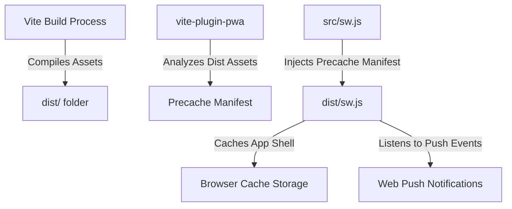

# Design Document: Progressive Web App (PWA) Support

This document details the architecture, design choices, and implementation steps required to transform the DailyFX React frontend into a Progressive Web App (PWA) using `vite-plugin-pwa` with custom Service Worker push notification logic.

## Goal
Transform DailyFX into an installable, mobile-friendly application (PWA) that:
1. Supports installation on iOS, Android, and Desktop platforms.
2. Implements static asset caching (offline support) via a Service Worker.
3. Preserves existing Web Push notification listeners (push/click handling) by combining them with Workbox precaching in a single Service Worker.
4. Auto-updates in the background when a new version of the frontend is deployed.

---

## Architecture & Core Decisions

### 1. Vite PWA Plugin in `injectManifest` Mode
We will utilize `vite-plugin-pwa` to automate the PWA assets compilation (manifest generation and injecting the build precache assets).
We choose the `injectManifest` strategy instead of the default `generateSW`. This allows us to keep complete control of the Service Worker logic, enabling us to preserve existing Web Push notifications code while letting Workbox handle files caching in the background.



### 2. Service Worker Migration
*   **Source**: `frontend/public/sw.js` (Web Push only)
*   **Destination**: `frontend/src/sw.js` (Workbox caching + Web Push)
*   The Service Worker is moved to `src/sw.js` to allow Vite and the Workbox build tools to process it. During build time, the plugin compiles this file and outputs it to `dist/sw.js`, injecting the array of precached assets into `self.__WB_MANIFEST`.

---

## File-by-File Changes

### 1. `frontend/package.json`
Add `vite-plugin-pwa` to `devDependencies` and `workbox-precaching` to `dependencies` (if needed, though `vite-plugin-pwa` bundles workbox-precaching, we will import it directly in the service worker).
*   Add `vite-plugin-pwa` as a devDependency.

### 2. `frontend/vite.config.ts`
Configure `VitePWA`:
```typescript
import { VitePWA } from 'vite-plugin-pwa';

// Add VitePWA to plugins:
VitePWA({
  strategies: 'injectManifest',
  srcDir: 'src',
  filename: 'sw.js',
  registerType: 'autoUpdate',
  injectManifest: {
    injectionPoint: 'self.__WB_MANIFEST',
  },
  manifest: {
    name: 'DailyFX for Immich',
    short_name: 'DailyFX',
    description: 'Turn your static photo library into a creative, AI-powered playground.',
    theme_color: '#065f46',
    background_color: '#f5f5f4',
    display: 'standalone',
    orientation: 'portrait',
    icons: [
      {
        src: 'pwa-192x192.png',
        sizes: '192x192',
        type: 'image/png',
      },
      {
        src: 'pwa-512x512.png',
        sizes: '512x512',
        type: 'image/png',
      },
      {
        src: 'icon.svg',
        sizes: 'any',
        type: 'image/svg+xml',
        purpose: 'any maskable',
      }
    ],
  },
})
```

### 3. `frontend/src/sw.js`
At the top of `src/sw.js`, import precaching functions:
```javascript
import { precacheAndRoute, cleanupOutdatedCaches } from 'workbox-precaching';

// Precache list injected by vite-plugin-pwa
precacheAndRoute(self.__WB_MANIFEST || []);

// Immediately clean up old caches from previous builds
cleanupOutdatedCaches();

// Existing Push Notification listeners...
self.addEventListener('push', (event) => { ... });
self.addEventListener('notificationclick', (event) => { ... });
```

### 4. `frontend/src/pages/Presets.tsx`
Remove the custom `navigator.serviceWorker.register('/sw.js')` invocation in `useEffect` (line 1047), as `vite-plugin-pwa` handles this automatically via the auto-injected script `/registerSW.js`.
Keep `navigator.serviceWorker.ready` usage for push notification subscriptions:
```typescript
const reg = await navigator.serviceWorker.ready;
// Continue to use reg.pushManager.subscribe(...)
```

### 5. `frontend/index.html`
Link the vector icon and add PWA meta tags in the `<head>`:
```html
<link rel="icon" type="image/svg+xml" href="/icon.svg" />
<link rel="apple-touch-icon" href="/pwa-192x192.png" />
<meta name="theme-color" content="#065f46" />
<meta name="mobile-web-app-capable" content="yes" />
<meta name="apple-mobile-web-app-capable" content="yes" />
<meta name="apple-mobile-web-app-status-bar-style" content="black-translucent" />
<meta name="apple-mobile-web-app-title" content="DailyFX" />
```

### 6. App Icons (SVG and PNGs)
*   **Vector Icon (`frontend/public/icon.svg`)**: Create a beautiful, responsive SVG containing a camera aperture and creative filter styling.
*   **PNG Icons (`frontend/public/pwa-192x192.png`, `frontend/public/pwa-512x512.png`)**: Create rasterized versions of the logo.

---

## Verification & Testing Plan

1.  **Build Verification**:
    *   Run `npm run build` in the frontend directory and verify that it compiles without TypeScript or plugin errors.
    *   Check `dist/` folder to ensure it contains:
        *   `sw.js` (including bundled workbox code and push handlers).
        *   `manifest.webmanifest`.
        *   `registerSW.js`.
2.  **Lighthouse Audit / PWA Validation**:
    *   Open Chrome DevTools -> Application tab -> Manifest. Check that the manifest properties match and that the PWA is marked as installable.
3.  **Offline Capability**:
    *   Disconnect the network in DevTools (Offline mode) and verify that reloading the page renders the DailyFX shell.
4.  **Web Push Notifications**:
    *   Go to Presets -> Notifications, enable Web Push, and verify that the subscription is registered successfully through the PWA service worker.
