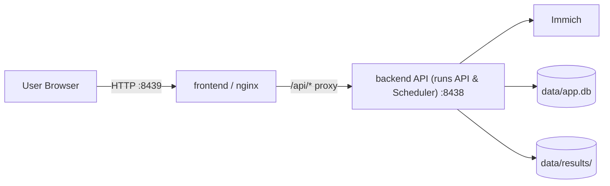

# Self-Hosting Guide

This guide is for people who want to run DailyFX on their own network with Immich.

## What You Need
- Docker and Docker Compose
- A running Immich instance
- A strong `APP_SECRET_KEY`

## Repository Layout
- `backend/` runs the API and scheduler
- `frontend/` serves the web UI
- `data/` stores the SQLite database, generated images, and cached examples

## Architecture



- The browser talks to the frontend on port `8439`.
- The frontend proxies API requests to the backend on port `8438`.
- The backend reads and writes persistent state under `data/`.
- The scheduler runs in the background of the backend container so automated runs keep working even if the UI is not open.

## Initial Setup
1. Clone the repository.
2. Copy `.env.example` to `.env`.
3. Fill in the required system-level secret key:

```env
APP_SECRET_KEY=generate-a-long-random-secret
```

Optional env values:
- `TZ` sets the timezone used by the containers for timestamps and scheduled jobs.
- `APP_ACCESS_TOKEN` protects the UI and API with a login token.
- `APP_EXTERNAL_URL` helps notification links point to the correct public URL.
- `APP_CONTACT_EMAIL` sets the administrator contact email.
- `CORS_ORIGINS` should include any custom frontend origin you expose.
- `EXAMPLE_ASSET_ID` sets a default preview asset ID.
- `LOG_JSON` enables structured JSON logging when set to `true`.

The bundled `.env.example` is already tuned for Docker-based self-hosting: `APP_ENV=production`, `DATA_DIR=/data`, and `DATABASE_URL=sqlite:////data/app.db`.

## Run It Locally
```bash
docker compose up --build -d
```

On startup, the backend runs a preflight check that validates the loaded configuration and verifies that the data directory and SQLite path are writable before the API and scheduler begin.

The default ports are:
- `8439` for the web UI
- `8438` for the backend API

The frontend nginx container proxies `/api/*` to the backend, so the browser talks to a single origin when you use the published web port.

## First Login & Configuration
- Open `http://localhost:8439`
- If `APP_ACCESS_TOKEN` is set in `.env`, enter that token on the login screen to authenticate.
- Go to the **Settings** tab to configure your Immich URL, Immich API Key, and optional AI API keys (OpenAI, Gemini, OpenRouter, BytePlus for image generation, Xiaomi).
- Per-schedule AI provider/model selection lives in the **Schedules** tab, not in global settings.
- Go to **Filters**, **Effects**, and **Notifications** tabs to configure presets.
- Go to the **Schedules** tab to schedule automatic generations.
- For a concise explanation of how a run moves from schedule to review, see [How It Works](how-it-works.md).

## Updating
- Pull the latest changes from GitHub
- Rebuild and restart the stack:

```bash
docker compose up --build -d
```

If you want to rebuild only specific services:

```bash
docker compose build api web
docker compose up -d api web
```

## Backups
- Back up the entire `data/` directory regularly
- `data/app.db` contains settings, presets, schedules, and history
- `data/results/` contains generated images that are still pending review

## Security Notes
- Do not commit real secrets, API keys, or database files
- If you expose the app outside your LAN, always set `APP_ACCESS_TOKEN`
- Use HTTPS and a reverse proxy if you publish the service to the internet
- Restrict `CORS_ORIGINS` to trusted origins when using a custom domain

### Running as Non-Root / File Permissions
To ensure security, the backend container runs under the unprivileged `nobody` user by default (defined in the [Dockerfile](file:///opt/dailyFX/backend/Dockerfile)).

However, during local development or self-hosting, when using a bind mount for the `data/` directory (`- ./data:/data`), files created inside the container might be written with different permissions or become owned by root. To prevent this:
1. In [docker-compose.yml](file:///opt/dailyFX/docker-compose.yml), the `api` service is configured with `user: "${UID:-1000}:${GID:-1000}"`. This maps the container process to your local host user's UID and GID so that files written to `./data` remain owned by you.
2. If you are deploying in a production environment (such as Kubernetes or a hardened server) without bind mounts, the container will run securely as the `nobody` user (UID `65534`).


## Troubleshooting
- If the backend exits immediately, check the logs for the preflight error; it will name the invalid setting or unwritable path.
- If the UI cannot reach Immich, re-check the URL and API key in **Settings**, then rerun the connection test.
- If login loops, confirm the browser token matches `APP_ACCESS_TOKEN` in `.env`.
- If schedules do not run, check that the `api` container is healthy and the schedule is enabled.
- If timestamps look wrong, adjust `TZ` in `.env` and restart the stack.
- For a user-oriented overview of the workflow, see [How It Works](how-it-works.md).
- For API details, see [docs/api.md](api.md).
- For frontend behavior, see [docs/frontend.md](frontend.md).

## CLI Handoff
You can run one scheduled generation and hand the result to an AI agent from the repo root:

```bash
./dailyfx-agent --schedule-id 1 --target agy
```

If you do not know the schedule ID yet, list available schedules first:

```bash
./dailyfx-agent --list-schedules
```

If you prefer `make`, the same flow is available as:

```bash
make agent SCHEDULE_ID=1 TARGET=agy
```

That command prepares the run inside Docker, writes a manifest to `data/dailyfx-run.json` by default, renders the image on the host into `data/results/`, and then finalizes the result in the backend.

If you want to use `codex`, you can customize the command template:

```bash
./dailyfx-agent \
  --schedule-id 1 \
  --target codex \
  --model gpt-5.5 \
  --codex-command-template 'exec --image {image_path} -'
```

The wrapper quotes the substituted values for you, so keep the placeholders unquoted in the template. The prompt is sent on stdin, so the template only needs the image and any optional wrapper flags.

You can also customize `agy` the same way:

```bash
./dailyfx-agent \
  --schedule-id 1 \
  --target agy \
  --model gpt-5.5 \
  --agy-command-template '--print --image {image_path}'
```

To inspect available host-side models first:

```bash
./dailyfx-agent --list-models --target agy
./dailyfx-agent --list-models --target codex
```

Use `--dry-run` to print the prepare, render, and finalize commands without executing anything.
Use `--verbose` to print the loaded manifest to stderr before the target tool is called.

## FAQ

### Can I run this only on my LAN?
Yes. Keep `APP_ACCESS_TOKEN` enabled and expose only the ports you need on your local network. No public DNS or cloud service is required.

### Do I need AI keys?
No. They are only required for AI-based image effects. The rest of the app works with Immich alone.

### Where are my generated images stored?
Generated images live in `data/results/` until they are accepted, rejected, or cleaned up by the retention job.

### Can I use my own domain?
Yes. Put DailyFX behind a reverse proxy and set `APP_EXTERNAL_URL` so notification links point to the correct address.

### What should I back up?
Back up `data/app.db` and `data/results/`. If you want to preserve all runtime state, back up the entire `data/` directory.

### Why do I see a login screen?
Your backend has `APP_ACCESS_TOKEN` enabled. Enter the same token in the browser to unlock the UI.
